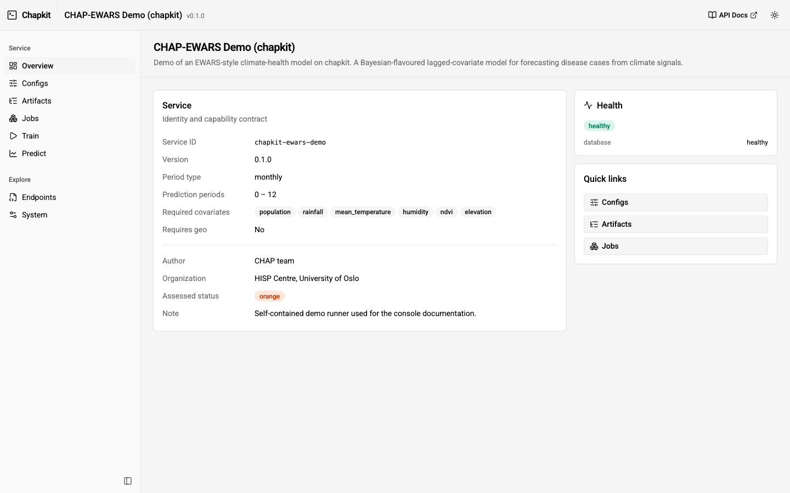
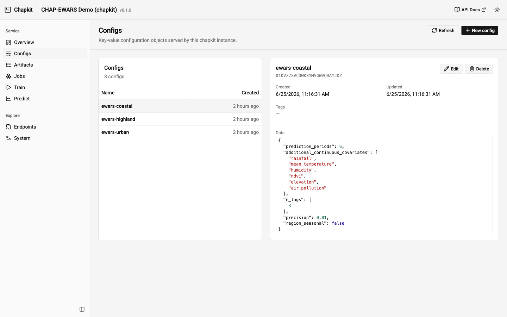
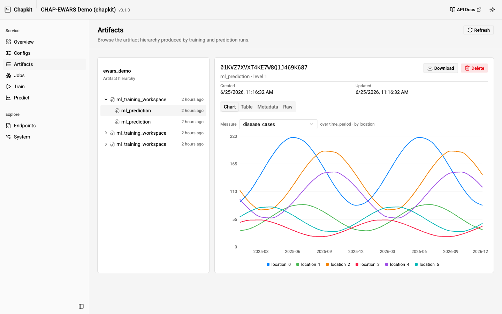
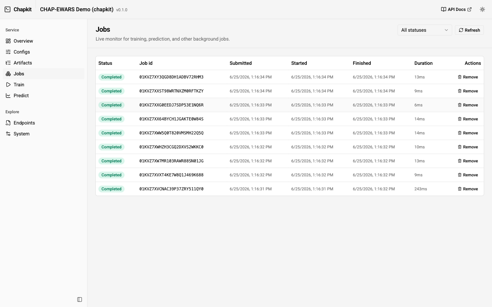
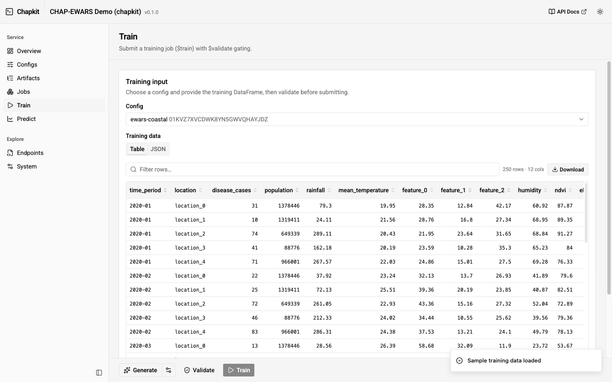

# Web Console

Every chapkit service ships a built-in web console: a single-page app served at
the service root (`/`) that lets you explore and operate a running service from a
browser. It talks directly to the service's own `/api/v1` endpoints, so it works
standalone with no DHIS2 or other host application in the loop. This makes it a
fast way to inspect a session after, say, a `chapkit test` run.

## Opening the console

Start any chapkit service and open its root URL:

```bash
cd my-model
uv run python main.py   # or: fastapi dev main.py
```

Then visit `http://localhost:8000/` (or the port your service uses). The console
replaces the previous static landing page; the underlying Swagger UI is still
available at [`/docs`](http://localhost:8000/docs) and is linked from the console
header and sidebar.



The console follows your operating system's light/dark preference automatically,
and you can override it with the toggle in the top bar.

The console is enabled by `with_landing_page()`, which `MLServiceBuilder` and the
chapkit `ServiceBuilder` call by default. It is mounted as a static app, so it is
served straight from the installed package with no Node.js runtime required.

## Screens

| Screen | What it does |
| --- | --- |
| **Overview** | Service identity, version, model metadata, capability contract (period type, prediction-period bounds, required covariates), and health. |
| **Configs** | Browse, create, edit, and delete configs inline (no modal). The data editor is a CodeMirror JSON editor with schema-aware autocomplete and validation driven by the service's config JSON schema; new configs are pre-filled from that schema. |
| **Artifacts** | Browse the artifact hierarchy as a tree, inspect metadata, preview dataframe content, and download artifact contents. |
| **Jobs** | Live job monitor (auto-refreshing) with status, timing, error tracebacks, cancellation, and a link from a completed job to its result artifact. |
| **Train** | Submit `$train` jobs interactively, with `$validate` gating and a tunable sample-data generator (see below). |
| **Predict** | Submit `$predict` jobs from a trained model, with the same `$validate` gating and sample-data generator. |
| **Endpoints** | Every HTTP operation exposed by the service, parsed from `/openapi.json`, grouped by tag and filterable. Links out to Swagger. |
| **System** | Runtime information (host, platform, Python, timezone) and the static apps mounted by the service. |

## Seeding a session

The console is read-write, but the quickest way to populate a service with
realistic data is the CLI test runner, which drives the full
config -> train -> predict flow:

```bash
cd my-model
chapkit test --url http://localhost:8000
```

See [Testing ML Services](testing-ml-services.md) for options. After it runs,
refresh the console to browse the configs, artifacts, and jobs it produced.







## Interactive train / predict

The **Train** and **Predict** screens submit `$train` and `$predict` jobs
directly. Both flows are gated by `$validate`: the submit button stays disabled
until a validation of the current inputs returns no error-severity diagnostics.
Editing the payload clears the validated state, so you always submit something
that has just been validated.



The flow is **Generate -> Validate -> Train/Predict**. The split **Generate**
button fills the form with sample data for the selected config/model (a gear opens
the generator options); **Validate** runs `$validate` with no job submitted, which
enables the submit button; submitting fires a toast with the job's ULID and a
**View jobs** link. The data field has **Table** and **JSON** views (the JSON pane
is a read-only viewer with an Edit toggle), and an empty field hints the model's
expected columns. Sample-data generation is side-effect-free, so the whole
generate -> inspect -> validate loop never touches your data.

### Tunable sample data

To make trying things out easy, the console can fill the train/predict forms with
synthetic data produced by chapkit's own data generator
(`chapkit.data.TestDataGenerator` — the same generator the CLI test runner uses).
The **Sample data generator** panel exposes the generator's parameters
(locations, periods, features, period type, geometry type, seed), so you can shape
the data before generating it.

Under the hood this calls a small endpoint that is added whenever ML is enabled:

```
GET /api/v1/ml/$generate-sample-data?kind=train|predict
```

Query parameters:

| Parameter | Default | Notes |
| --- | --- | --- |
| `kind` | `train` | `train` returns `{ data, config_id?, geo? }`; `predict` returns `{ historic, future, geo? }`. |
| `config_id` | — | Echoed into a train payload for convenience. |
| `num_locations` | `5` | Panel locations. |
| `num_periods` | `50` | Time periods per location. |
| `num_features` | `3` | Extra feature columns. |
| `period_type` | from service | `monthly` or `weekly`; defaults to the service's declared period type. |
| `geo_type` | `polygon` | `polygon` or `point`. |
| `include_geo` | from service | Force geometry on/off; defaults to the service's `requires_geo`. |
| `seed` | `42` | Generator seed for reproducibility. |

The required covariates come from the service's `MLServiceInfo`, so the generated
columns line up with what the model expects. Because the generator is shared with
the CLI, the data you generate in the console matches what `chapkit test` produces.

## Developing the console

The console source lives in `frontend/` (Vite + React + Tailwind + shadcn/ui). The
production build is committed under `src/chapkit/api/apps/console/` so it ships in
the wheel. To work on it:

```bash
cd frontend
pnpm install
pnpm dev          # dev server, proxies /api to http://localhost:8000
pnpm build        # writes the bundle into src/chapkit/api/apps/console/
```

Point the dev server at a different service with
`VITE_CHAPKIT_TARGET=http://localhost:9090 pnpm dev`. After changing the UI, run
`pnpm build` and commit the regenerated assets along with your source changes.
